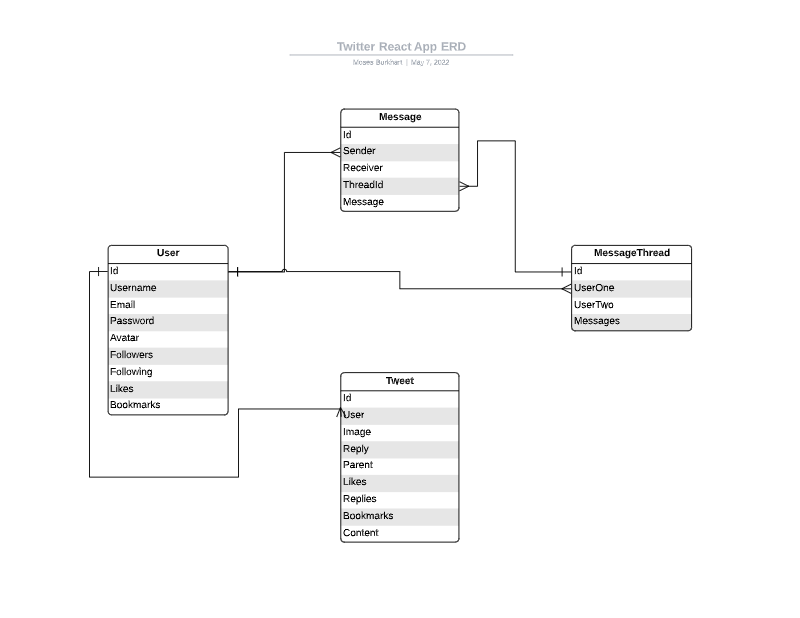

# Twitter React App
An app that is supposed to mimic the functionality of the social media app Twitter with some features being limited.

# Getting Started
[Heroku Link](https://moses-twitter-react.herokuapp.com/)
[Trello board](https://github.com/mosesb1/twitter-react-app/projects/1)

# Technologies Used
- JavaScript
- HTML
- CSS
- React
- Node
- Express
- Mongoose/MongoDB
- Bcrypt
- Cloudinary
- Heroku
- Git/Github

# ERD

# Wireframes & Screenshots

# Unsolved problems and future enhancements

The only currently unsolved problem is creating a real time version of the direct messaging system.

The following features are potential enhancements in the future:
- Retweets
- Notfications
- Curated lists
- Search by username